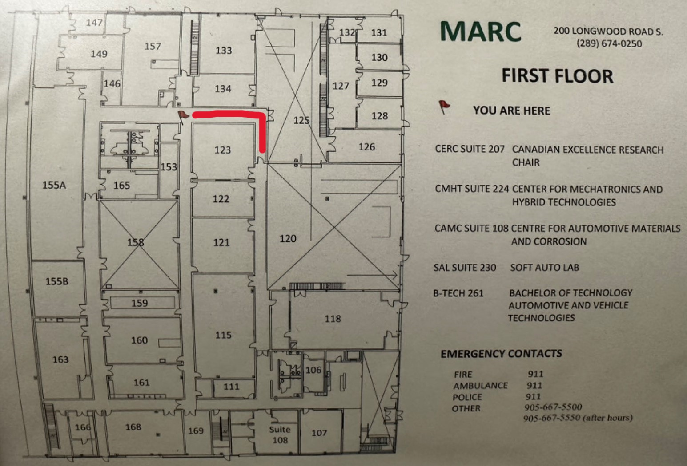
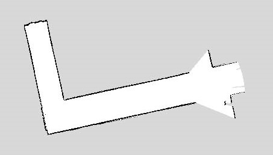

# Sidewalk Robot Outdoor Testing Code

This repository contains the code and configurations for the Sidewalk Robot project, focused on developing and modifying navigation algorithms for a Husky UGV to operate autonomously on sidewalks. The project primarily focuses on outdoor testing scenarios, ensuring the robot can navigate effectively in real-world environments.

The repository includes custom ROS packages and configurations designed to enhance the Husky's navigation capabilities. These modifications include adjustments for GNSS data collection, AMCL localization, and mapping processes.

The robot used in this project is provided by [CLEARPATH Robotics](https://docs.clearpathrobotics.com/docs/robots/outdoor_robots/husky/user_manual_husky), and the model tested is the MCM07 HUSKY. This project is developed and tested on **Ubuntu 20.04** with **ROS Noetic**.

## Prerequisites

Ubuntu install of ROS Noetic guide is provided at the following link:
- [ROS Noetic Installation Guide](https://wiki.ros.org/noetic/Installation/Ubuntu)

Install the Husky ROS navigation stack. To quickly install the navigation stack, use the following command:

```bash
sudo apt-get install ros-noetic-husky-navigation
```

For full Husky UGV tutorials, please refer to the detailed guide provided by CLEARPATH Robotics at the following link:

- [Husky ROS Noetic Installation Guide](https://www.clearpathrobotics.com/assets/guides/noetic/husky/index.html)

## Repository Structure

```plaintext
my_package/
├── launch/
│   ├── launch_mapping.launch
│   ├── launch_amcl.launch
│   └── duro_gnss_data_collection.launch
├── maps/
│   ├── MARC_IndoorL1.pgm
│   ├── MARC_IndoorL1.yaml
│   ├── MARC_OutdoorGoogle.pgm
│   ├── MARC_OutdoorGoogle.yaml
│   ├── MARC_OutdoorTurn.pgm
│   └── MARC_OutdoorTurn.yaml
├── rviz/
│   ├── robot_mapping.rviz
│   └── robot_navigation.rviz
├── images/
│   ├── MARC_L1.jpg
│   ├── MARC_L1_pgm.jpg
│   ├── MARC_GoogleMap.jpg
│   └── MARC_GoogleMap_pgm.jpg
└── src/
```

### `launch/`

This directory contains launch files for various operations:

- **launch_mapping.launch**: Launch file for creating maps of the environment.

Sample usage:

```bash
# Start the mapping process using the launch file from the my_package package
roslaunch my_package launch_mapping.launch
```

```bash
# Save the map after scanning, specifying the filename prefix
rosrun map_server map_saver -f ~/maps/my_map
```

- **launch_amcl.launch**: Launch file for running AMCL (Adaptive Monte Carlo Localization).

Sample usage:

```bash
# Start the navigation process with the specified map and custom scan topic
roslaunch my_package launch_amcl.launch map_name:=my_map.yaml
```

- **duro_gnss_data_collection.launch**: Launch file for collecting GNSS data (not required for mapping and navigation).

Sample usage:

```bash
# Launch the Piksi Multi node using default settings
roslaunch my_package duro_gnss_data_collection.launch
```

### `maps/`

This directory contains pre-generated maps used by the navigation stack:

- **MARC_IndoorL1.pgm / .yaml**: Indoor map files.

<p align="center">
  
  
</p>

- **MARC_OutdoorGoogle.pgm / .yaml**: Outdoor map files from Google.
- **MARC_OutdoorTurn.pgm / .yaml**: Turn-specific outdoor maps.

### `rviz/`

This directory contains RViz configuration files for visualizing the robot’s environment and navigation:

- **robot_mapping.rviz**: RViz configuration for mapping.
- **robot_navigation.rviz**: RViz configuration for navigation.

### `src/`

This directory is reserved for custom source code related to the project.

## Installation and Setup

### Cloning the Repository

After installing the Husky ROS navigation stack, clone this repository into your ROS workspace:

```bash
cd ~/catkin_ws/src
git clone https://github.com/your-username/your-repo-name.git
```

### Building the Workspace

Navigate back to your workspace and build the packages:

```bash
cd ~/catkin_ws
catkin_make
source devel/setup.bash
```

## Usage

### GNSS Data Collection

To collect GNSS data, use the following launch file:

```bash
roslaunch my_package/launch/duro_gnss_data_collection.launch
```

### AMCL Localization

To run AMCL for localization, use the following launch file:

```bash
roslaunch my_package/launch/launch_amcl.launch
```

### Mapping

To create maps of the environment, use the following launch file:

```bash
roslaunch my_package/launch/launch_mapping.launch
```

### RViz Visualization

To visualize the robot’s mapping or navigation:

```bash
roslaunch my_package/rviz/robot_mapping.rviz
roslaunch my_package/rviz/robot_navigation.rviz
```

## Contributing

Contributions are welcome! Please fork this repository, make your changes, and submit a pull request.

## License

This project is licensed under the MIT License - see the [LICENSE](LICENSE) file for details.

## Acknowledgments

- Original Husky navigation stack from [CLEARPATH Robotics](https://www.clearpathrobotics.com/).
- The ROS community for providing necessary tools and libraries.
